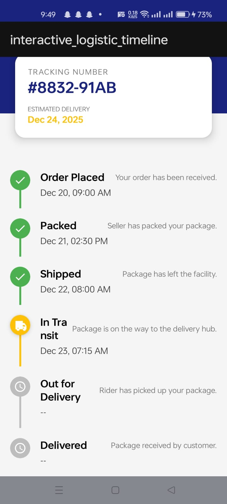
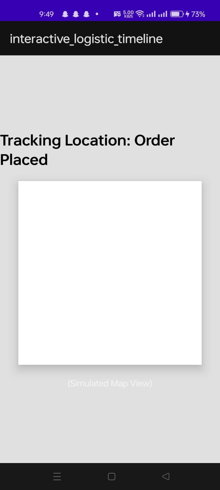

# 🚚 Interactive Delivery Tracker (Android Native)

> A professional logistics timeline interface built with native Android (Java). Features dynamic status tracking, expandable details, and simulated real-time actions.

## 📱 Project Overview

This project demonstrates a modern, interactive UI for logistics and supply chain applications. Unlike static lists, this timeline allows users to track shipment progress with visual cues and perform context-aware actions like calling a driver or viewing a live location map.

### Key Features

* **Dynamic Timeline UI:** Custom `RecyclerView` adapter that renders different visual states (Completed, Active, Pending).
* **Interactive Expandability:** Users can tap any timeline row to reveal hidden action buttons.
* **Smart Status Logic:**
* ✅ **Completed:** Green visual indicators.
* 🚚 **Active:** Amber/Orange indicators with "Glow" effect (Elevation).
* 🕒 **Pending:** Greyed-out future steps.


* **Action Integration:**
* 📞 **Call Driver:** Launches the native Android dialer.
* 🗺️ **Live Map:** Navigates to a simulated GPS tracking screen.


## 🛠️ Tech Stack

* **Language:** Java
* **UI/Layout:** XML, ConstraintLayout, CardView
* **Components:** RecyclerView, Intents (Implicit & Explicit)
* **IDE:** Android Studio Ladybug / Koala

## 📸 Screenshots
| Timeline View | Expanded View | Simulated Map |
|:---:|:---:|:---:|
|  |  |  |
## 🚀 Getting Started

### Prerequisites

* Android Studio installed.
* JDK 11 or higher.

### Installation

1. **Clone the repository**
```bash
git clone https://github.com/noormalik33/interactive-delivery-tracker-android-native.git

```


2. **Open in Android Studio**
* File > Open > Select the cloned folder.


3. **Sync Gradle**
* Allow the project to download necessary dependencies.


4. **Run the App**
* Connect a device or start an emulator and click "Run".


## 🧩 Code Highlight

The project uses a custom `Enum` to handle state logic efficiently within the Adapter:

```java
// TimelineModel.java
public enum Status {
    COMPLETED, ACTIVE, PENDING
}

// TimelineAdapter.java (Visual Logic)
switch (item.getStatus()) {
    case ACTIVE:
        holder.markerCard.setCardBackgroundColor(amberColor);
        holder.markerCard.setCardElevation(12); // "Pop" effect
        holder.layoutActions.setVisibility(View.VISIBLE); // Show buttons
        break;
    // ...
}

```

## 🔮 Future Improvements

* [ ] Integrate Google Maps SDK for real GPS tracking.
* [ ] Fetch timeline data from a REST API (Retrofit).
* [ ] Add Dark Mode support for the map activity.

## 🤝 Contributing

Contributions are welcome! Please feel free to submit a Pull Request.

---


## 👩‍💻 Developer

**Noor Malik**  
IT Student  
📍 Islamabad, Pakistan  
📧 Email: noormalik56500@gmail.com  
🔗 [LinkedIn](https://www.linkedin.com/in/noormalik56500/)

Social 📱

📧 Email: mailto:coreittech1@gmail.com  
📹 YouTube: https://www.youtube.com/@CoreITTech1  
📸 Instagram: https://www.instagram.com/coreit.tech  
📘 Facebook: https://www.facebook.com/share/1AmgLDUnc9/  